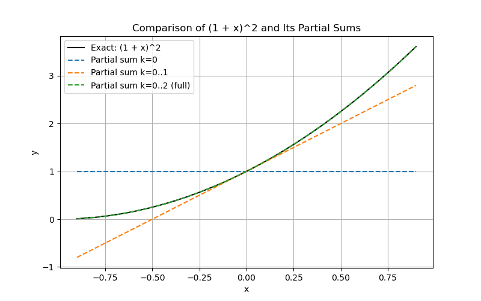
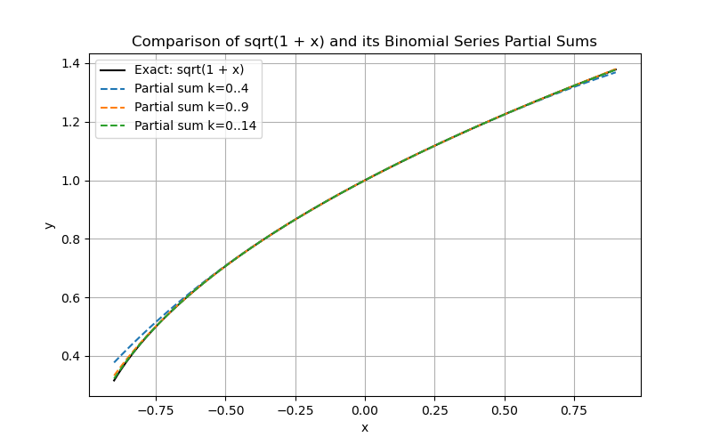

# 1) The Maclaurin series for $(1 + x)^n$ is also known as the binomial series. 
$(1+x)^{n}= 1 + nx + \frac{n(n-1)}{2!} +  \cdots  (x^{2}<1)$

> [!NOTE]
> I found a more general form of the binomial theorem for it (valid for $|x| < 1$):
> $(1 + x)^n = \sum_{k=0}^{\infty} \binom{n}{k} x^k$
> 
> Also, the generalized binomial coefficient is:
> $\binom{n}{k} = \frac{n (n - 1) (n - 2) \cdots (n - k + 1)}{k!}$.
> 

## a. Derivation
1. Let $f(x) = (1 + x)^n$.
    
2. The $k$th derivative evaluated at $x=0$ is:
    $f^{(k)}(0) = n(n-1)(n-2)\cdots(n-k+1)$.
    
3. By the Maclaurin series formula:
	1. $(1 + x)^n$
	2. $$= \sum_{k=0}^{\infty} \frac{f^{(k)}(0)}{k!} x^{k}$$
	3. $$= \sum_{k=0}^{\infty} \frac{n (n-1) \cdots (n-k+1)}{k!} x^k$$
---
## b. Particular Cases

### **Case a: $n = 2$**
$(1 + x)^2 = 1 + 2x + x^2$.

Here, I will put it in summation notation:
- $(1 + x)^{2}$
- $= \sum_{k=0}^{2} \binom{2}{k} x^{k}$
- $= 1 + 2x + x^2$

### **Case b: $n = 3$**
For $n=3$:
$(1 + x)^3 = 1 + 3x + 3x^2 + x^3$.

Or in summation notation:
- $(1 + x)^{3}$
- $$= \sum_{k=0}^{3} \binom{3}{k} x^k$$
- $= 1 + 3x + 3x^2 + x^3$

### **Case c: $n = \frac{1}{2}$**
$$(1 + x)^{\frac{1}{2}} = 1 + \frac{1}{2} x - \frac{1}{8} x^2 + \frac{1}{16} x^3 - \cdots$$
Where:
- $k=0$: $1$
- $k=1$: $\frac{1}{2} x$
- $k=2$: $$\frac{\frac{1}{2} (-\frac{1}{2})}{2} x^2 = -\frac{1}{8} x^2$$
- $k=3$: $$\frac{\frac{1}{2} (-\frac{1}{2}) (-\frac{3}{2})}{3!} x^3 = \frac{1}{16} x^3$$

---
## c. **Computing $\sqrt{1.0001}$ to 15 Decimal Places**
Using the series expansion for $n = \frac{1}{2}$ with $x = 0.0001$:
$$\sqrt{1.0001} = \sum_{k=0}^{\infty} \binom{\frac{1}{2}}{k} (0.0001)^k$$
Using a Python script to compute it:
```python
import math

def generalized_binomial(n, k):
    num = 1
    for i in range(k):
        num *= (n - i)
    return num / math.factorial(k)

def binomial_series(n, x, terms=20):
    s = 0
    for k in range(terms):
        s += generalized_binomial(n, k) * (x**k)
    return s

approx = binomial_series(0.5, 0.0001, terms=20)
actual = math.sqrt(1.0001)

print("Series approximation :", approx)
print("math.sqrt(1.0001)    :", actual)
```

> [!NOTE]
> User/CSC 446 - Compiler Construction/MathQuest.py"
Series approximation : 1.0000499987500624
math.sqrt(1.0001)    : 1.0000499987500624

The result, rounded it up to **15** decimal places is
$\sqrt{1.0001} \approx 1.000049998750063$.


---
# 2) Use the series in the preceding problem to obtain series (4). How could this series be used on a computlng machine to produce x /y if only addition and multiplication are built-in operations?

## a. Obtaining series (4) $n = 4$
For $n=4$:
$(1 + x)^4$
$$=\frac{4!}{0!\left(4-0\right)!}\cdot \:1^4x^0+\frac{4!}{1!\left(4-1\right)!}\cdot \:1^3x^1+\frac{4!}{2!\left(4-2\right)!}\cdot \:1^2x^2+\frac{4!}{3!\left(4-3\right)!}\cdot \:1^1x^3+\frac{4!}{4!\left(4-4\right)!}\cdot \:1^0x^4$$

Or in summation notation:
- $(1 + x)^{4}$
- $$= \sum_{k=0}^{4} \binom{4}{k} x^k$$
- $1+4x+6x^2+4x^3+x^4$

### Using the Series to Compute $x/y$ Using Only Addition & Multiplication
- I can break $x/y$ into $x \cdot \frac{1}{y}$:
	$\frac{x}{y} = x \cdot \frac{1}{y}$
- Using the binomial expansion for $1/(1+z)$:
	$\frac{1}{1+z} = 1 - z + z^2 - z^3 + \cdots, \quad |z| < 1$. 
- If $y$ is close to $1$, we can write $y = 1 + z$ and approximate:
	$\frac{1}{y} = 1 - (y - 1) + (y - 1)^2 - \cdots$.
So, we can compute $x/y$ 
Thus, $x/y$ can be computed using only additions and multiplications, which was useful in early computing when division was expensive.

---
# ACM
## Sawyer's question
### Something cool
#### Nehhhh

$e = mc^{2}$

---
# 3) Use the previous problem to obtain a series for $(1 + x^2)^{-1}$.
- We know from the binomial-series result
	$(1 + x)^n = \sum_{k=0}^{\infty} \binom{n}{k} x^{k}$
	$|u| < 1$
- I'll set n = -1 and u = x^2
	$(1 + x^2)^{-1} = \sum_{k=0}^{\infty} \binom{-1}{k} {x^{2}}^k$
	- Lets try n as -1 and u as x^2
		$\binom{-1}{k} = \frac{(-1)(-2)\cdots(-k)}{k!} = (-1)^k$
- So
	- $(1 + x^2)^{-1} \;=\;\sum_{k=0}^{\infty} (-1)^k\,x^{2k} \;=\; 1 \;-\; x^2 \;+\; x^4 \;-\; x^6 \;+\;\cdots \quad\bigl(\text{for }|x|<1\bigr)$

> [!NOTE]
> This is the geometric seres with the ratio $-x^2$


---


---
# 13. Using the Alternating Series Theorem to Approximate $\ln 1.1$ with Error Less Than $\frac{1}{2} \times 10^{-8}$

## Lets find the Relevant Alternating Series

Remember Maclaurin series expansion for $\ln(1 + x)$:
$\ln(1 + x) = x - \frac{x^2}{2} + \frac{x^3}{3} - \frac{x^4}{4} + \dots$

For small $x$ like $x = 0.1$, this is an alternating series. In our case, we set, so we use:
$\ln(1.1) = 0.1 - \frac{(0.1)^2}{2} + \frac{(0.1)^3}{3} - \frac{(0.1)^4}{4} + \dots$

The Alternating Series Estimation Theorem says that the error after $n$ terms is **at most** the absolute value of the next omitted term.
Here it is:
$\left| R_n \right| \leq \left| \frac{(0.1)^{n+1}}{n+1} \right| < \frac{1}{2} \times 10^{-8}$

## Use python (my favorite language) to find the Smallest $n$ Satisfying the Error Condition
We need to find the smallest $n$ such that:
$\frac{(0.1)^{n+1}}{n+1} < \frac{1}{2} \times 10^{-8}$

```python
# Solve for the smallest n that satisfies the inequality
import math

tolerance = 0.5 * 10**(-8)
x = 0.1

n = 1  # Start checking from the first term
while (x**(n+1)) / (n+1) >= tolerance:
    n += 1

print(n)
```

**Result:** The required number of terms is **7**.

So, we need **7 terms** in the series for $\ln(1.1)$ for us to have an error is less than $\frac{1}{2} \times 10^{-8}$.

---

# 14. Taylor Series Expansion of $f(x) = x^3 - 2x^2 + 4x - 1$ Around $x = 2$

## Compute Derivatives
We first compute the derivatives of $f(x)$.
- $f'(x) = 3x^2 - 4x + 4$
- $f''(x) = 6x - 4$
- $f'''(x) = 6$
- $f''''(x)=0$
- Higher derivatives
	- They will all be zero
## Evaluate at $x = 2$
Now, evaluate these at $x = 2$:
- $f(2) = 2^3 - 2(2^2) + 4(2) - 1 = 8 - 8 + 8 - 1 = 7$
- $f'(2) = 3(2^2) - 4(2) + 4 = 12 - 8 + 4 = 8$
- $f''(2) = 6(2) - 4 = 12 - 4 = 8$
- $f'''(2) = 6$

## I'll do the Taylor Expansion Around $x=2$
The Taylor series expansion at $x=2$ (using $h = x - 2$) is:
$$f(2 + h) = f(2) + f'(2) \cdot h + \frac{f''(2)}{2!} \cdot h^2 + \frac{f'''(2)}{3!} \cdot h^3$$

Substituting values:
$f(2 + h) = 7 + 8h + \frac{8}{2} h^2 + \frac{6}{6} h^3$

Simplify:
$f(2 + h) = 7 + 8h + 4h^2 + h^3$

Sooo, the **Taylor series expansion centered at $x=2$** is:
${f(2 + h) = 7 + 8h + 4h^2 + h^3}$