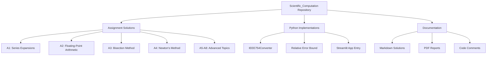
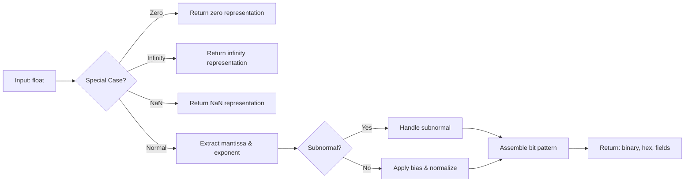

# Architecture Overview

This document provides a detailed overview of the Scientific Computation repository's structure, components, and design decisions.

## Table of Contents

- [System Overview](#system-overview)
- [Repository Structure](#repository-structure)
- [Module Descriptions](#module-descriptions)
- [Data Flow](#data-flow)
- [Design Patterns](#design-patterns)
- [Dependencies](#dependencies)

## System Overview

This repository is a **course assignment collection** for MATH 374 (Computational Theory). It is not a production application but rather a learning and demonstration project that implements various numerical computation algorithms and documents mathematical solutions.

### Purpose

1. **Educational**: Demonstrate understanding of numerical methods and computational mathematics
2. **Reference**: Serve as a reference implementation for common numerical algorithms
3. **Documentation**: Provide detailed solutions to course assignments with mathematical proofs

### Architecture Type

**Monolithic Repository** - All assignments and implementations are contained in a single repository with a flat directory structure organized by assignment number.



## Repository Structure

```
Scientific_Computation/
│
├── Assignment/                  # Main assignments directory
│   ├── A1-Assignment-1.2/       # Assignment 1
│   ├── A2-Assignment-CH1.3/     # Assignment 2 (with code)
│   ├── A3-Assignment-CH3.1/     # Assignment 3
│   ├── A4-Assignment-CH3.2/     # Assignment 4
│   ├── A5-Assignment-CH3.3/     # Assignment 5
│   ├── A6-Assignment-Ch4.1/     # Assignment 6
│   ├── A7-Assignment-CH4.3/     # Assignment 7
│   ├── A8-Assignment-CH5.1/     # Assignment 8
│   └── Assignment.md            # (Empty marker file)
│
├── docs/                        # Documentation
│   ├── ARCHITECTURE.md          # This file
│   └── DEVELOPMENT.md           # Development guide
│
├── requirements.txt             # Python dependencies
├── streamlit_app.py            # Streamlit application entry point
└── MATH 374 - Computational Theory.code-workspace  # VS Code workspace
```

### Directory Naming Convention

- Assignment directories follow the pattern: `A{N}-Assignment-{Chapter}`
- Each assignment directory is self-contained with:
  - Markdown solution files (`.md`)
  - PDF exports (`.pdf`)
  - Python implementations (`.py`) - where applicable
  - Supporting files (images, text outputs)

## Module Descriptions

### Assignment Directory

Each assignment directory contains solutions to specific computational mathematics problems.

#### A1-Assignment-1.2: Maclaurin and Taylor Series

**Purpose**: Series expansions and convergence analysis

**Contents**:
- Mathematical derivations for binomial series
- Specific cases for n=2, n=3, n=1/2
- Taylor series expansion around arbitrary points
- Visualizations (Figure_1.png, Figure_2.png)

**Implementation**: Mathematical proofs only (no code)

#### A2-Assignment-CH1.3: Floating-Point Arithmetic

**Purpose**: Understanding IEEE-754 representation and error analysis

**Contents**:
- `A2_IEEE754Converter.py`: Full implementation of IEEE-754 conversion
- `A2_Relative_Error_Bound.py`: Machine epsilon calculator
- Mathematical documentation in markdown
- Precision test results

**Key Implementation**: `IEEE754Converter` class

```python
class IEEE754Converter:
    def to_single(self, value: float) -> Dict[str, Any]
    def to_double(self, value: float) -> Dict[str, Any]
    def _float_to_ieee(self, value: float, ...) -> Dict[str, Any]
```

**Features**:
- Handles all IEEE-754 special cases
- Supports both 32-bit and 64-bit precision
- Returns comprehensive representation (binary, hex, fields)

#### A3-Assignment-CH3.1: Bisection Method

**Purpose**: Root-finding algorithm analysis and error bounds

**Contents**:
- Proof of bisection method convergence
- Error bound derivations
- Logarithmic convergence analysis

**Implementation**: Mathematical proofs only

#### A4-Assignment-CH3.2: Newton's Method

**Purpose**: Iterative root-finding with quadratic convergence

**Contents**:
- Derivation of Newton's method for square roots
- Convergence analysis and restrictions
- Formulas for cube roots with various functions

**Implementation**: Mathematical derivations only

#### A5-A8: Advanced Topics

**Purpose**: Higher-level numerical methods

**Topics**:
- A5 (3.3): Advanced numerical methods
- A6 (4.1): Polynomial interpolation using divided differences
- A7 (4.3): Advanced interpolation
- A8 (5.1): Numerical integration/differentiation

**Implementation**: Mathematical solutions and proofs

### Python Modules

#### `A2_IEEE754Converter.py`

**Responsibility**: Convert decimal numbers to IEEE-754 representation

**Key Functions**:
- `to_single(value)`: Convert to 32-bit representation
- `to_double(value)`: Convert to 64-bit representation
- `_float_to_ieee(...)`: Internal conversion logic

**Algorithm**:
1. Determine sign bit using `math.copysign`
2. Handle special cases (zero, infinity, NaN)
3. Extract mantissa and exponent using `math.frexp`
4. Normalize and apply bias
5. Handle subnormal numbers
6. Assemble bit pattern

**Edge Cases Handled**:
- Positive and negative zeros
- Positive and negative infinities
- Quiet NaN
- Subnormal (denormalized) numbers
- Rounding overflow to infinity

#### `A2_Relative_Error_Bound.py`

**Responsibility**: Calculate machine epsilon for floating-point systems

**Formula**: `0.5 * beta^(1 - n)`

**Parameters**:
- `beta`: Base of the floating-point system (e.g., 2, 10)
- `n`: Number of digits in the mantissa

**Use Case**: Understanding precision limits in numerical computations

#### `streamlit_app.py`

**Responsibility**: Web application entry point

**Current State**: References `Project_1/proj1B` module that is not present in the repository

**Status**: Incomplete or requires external dependency

## Data Flow

### IEEE-754 Conversion Flow



### Relative Error Bound Calculation Flow


## Design Patterns

### 1. Class-Based Converter

The `IEEE754Converter` uses a class structure to encapsulate conversion logic:

```python
class IEEE754Converter:
    # Public API
    def to_single(self, value: float) -> Dict[str, Any]
    def to_double(self, value: float) -> Dict[str, Any]
    
    # Private implementation
    def _float_to_ieee(self, value: float, ...) -> Dict[str, Any]
```

**Advantages**:
- Clear separation between public API and implementation
- Easily extensible for other precisions
- Reusable across different contexts

### 2. Functional Module

The `relative_error_bound` module uses a simple functional approach:

```python
def relative_error_bound(beta: float, n: int) -> float:
    return 0.5 * (beta ** (1 - n))
```

**Advantages**:
- Simple, single-purpose function
- No state management needed
- Easy to test and understand

### 3. Documentation-Driven Development

Each assignment follows a structured approach:
1. Problem statement (markdown)
2. Mathematical derivation
3. Implementation (if applicable)
4. Verification/results
5. PDF export for submission

## Dependencies

### Python Dependencies

```
streamlit>=1.0    # Web framework (for future interactive demos)
numpy>=1.0        # Numerical computing (currently unused but listed)
matplotlib>=3.0   # Plotting (for visualizations, currently unused)
```

### Standard Library Usage

- `math`: Mathematical functions (`copysign`, `frexp`, `isinf`, `isnan`)
- `typing`: Type hints for better code clarity
- `sys`, `os`: Path management in streamlit_app.py

### Dependency Conflicts

**Issue**: Current requirements.txt specifies:
```
streamlit==1.42.0
numpy==2.2.2
matplotlib==3.8.2
```

These versions have conflicting numpy requirements.

**Resolution**: Install compatible versions without pinning:
```bash
pip install streamlit matplotlib numpy
```

## Component Interaction

### Assignment Solutions

```
[Assignment Directory]
    ├── .md file   → Contains problem + solution
    ├── .pdf file  → Exported for submission
    └── .py file   → Implementation (optional)
          ↓
    [Standalone Execution]
          ↓
    [Console Output] or [Results File]
```

### Streamlit Integration (Future)

```
[streamlit_app.py]
    ├── Import Project_1.proj1B (missing)
    └── Launch web interface
```

**Status**: Not functional - missing Project_1 module

## Extensibility Points

### Adding New Numerical Methods

1. Create new assignment directory: `A{N}-Assignment-{Chapter}/`
2. Add markdown documentation: `A{N}-Assignment-{Chapter}.md`
3. Implement in Python: `A{N}_{MethodName}.py`
4. Follow existing patterns (type hints, docstrings, main block)
5. Add to README.md assignment overview table

### Adding Interactive Visualizations

1. Implement visualization in assignment directory
2. Export as PNG/SVG and reference in markdown
3. Optionally: Create Streamlit page for interactive version

### Adding Tests

Future improvement: Add `tests/` directory with:
- Unit tests for numerical methods
- Accuracy tests against known values
- Performance benchmarks

## Known Limitations

1. **Streamlit App**: References non-existent `Project_1` module
2. **No Tests**: No automated testing infrastructure
3. **Limited Reusability**: Code is assignment-specific, not packaged
4. **No CI/CD**: No continuous integration or deployment
5. **Documentation**: Some assignments lack detailed code comments

## Security Considerations

As this is an educational repository:
- No sensitive data handling
- No network operations (except Streamlit if running)
- No authentication or authorization
- No external API calls
- No database connections

**Risk Level**: Minimal - primarily mathematical computations

## Performance Considerations

Current implementations prioritize:
1. **Correctness** over performance
2. **Readability** over optimization
3. **Educational value** over production readiness

**Optimization Opportunities**:
- IEEE-754 converter could use bitwise operations instead of math functions
- Batch conversions could be parallelized
- Caching for repeated calculations

---

**Document Version**: 1.0  
**Last Updated**: February 2025  
**Maintained By**: John Akujobi
